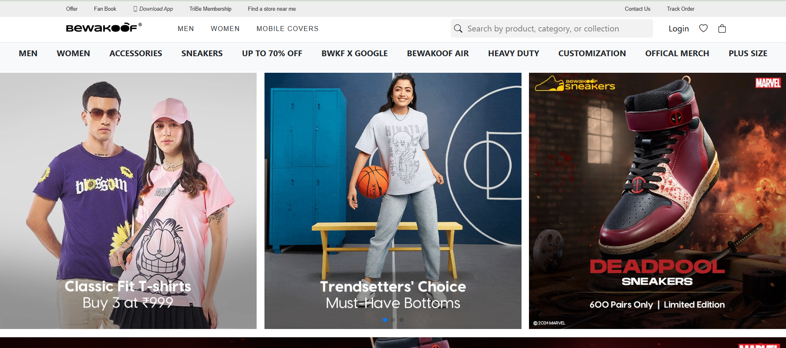

# Project Name

## Overview
This is a web application built using HTML, CSS, Bootstrap, and React. It includes user authentication via Firebase for Google and email authentication. Additionally, it integrates Toastify for notifications.

## Hosting Link
The application is hosted at:
[Live Website](https://bewakoof-website.vercel.app/)

## Features
- **User Authentication**: Google and email authentication using Firebase.
- **Product Management**: Display of products with descriptions and cart functionality.
- **Payment System**: Integration of a checkout and payment page.
- **Notifications**: Implemented using Toastify.
- **Responsive Design**: Built with Bootstrap for a mobile-friendly experience.

## Technologies Used
- HTML
- CSS
- Bootstrap
- React.js
- Firebase Authentication
- Toastify

## Screenshots
Below are some screenshots of different pages in the application:

### Home Page


### Product Page


### Description Page


### Cart Page


### Payment Page


## Installation
To run the project locally, follow these steps:

1. Clone the repository:
   ```sh
   git clone git@github.com:divyesh004/Bewakoof-website.git
   ```
2. Navigate to the project directory:
   ```sh
   cd project-folder
   ```
3. Install dependencies:
   ```sh
   npm install
   ```
4. Start the development server:
   ```sh
   npm start
   ```

## License
This project is licensed under the MIT License.
